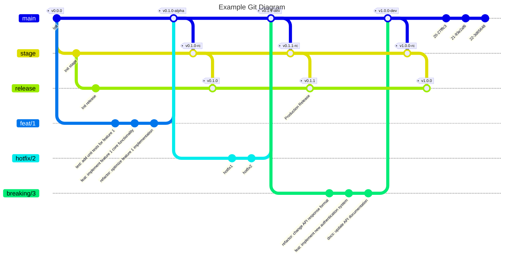

# Tag and Release

This repository demonstrates how to automate the release process using semantic versioning and GitHub Actions.
It provides a simple and effective way to manage versioned releases, ensuring consistent version control and streamlined
workflows.
By leveraging a custom JavaScript GitHub Action, this project helps you automate the creation of GitHub Releases based
on tagged versions.

# Features

## Label Checker

This workflow will manage semantic versioning labels (`major`, `minor`, and `patch`) for issues and pull requests.
These labels are essential for determining version bumps and maintaining consistent release workflow.

Planned features include:

- Automatic label creation and management
- Integration with issue and PR creation events
- Support for label modifications
- Externalized label configurations

### Default Label Configuration

The following labels are automatically managed:

| Label | Description           | Color                                       |
|-------|-----------------------|---------------------------------------------|
| major | Breaking Changes      | #d73a4a |
| minor | New Features          | #2ea44f |
| patch | Bug fixes and patches | #0969da |

### Usage

Note: Automatic label checking is currently under development. Please refer to issue #7 for implementation status and
planned features.
The label checker runs automatically when tag-and-release action is run.

## Branch Setup

This workflow configures the necessary branches for managing releases effectively.
These branches correspond to different deployment environments in the release pipeline.

### Default Branch Configuration

| Branch Name | Environment | Version Example |
|-------------|-------------|-----------------|
| main        | Development | v1.0.0-alpha    |
| stage       | Staging     | v1.0.0-rc       |
| release     | Production  | v1.0.0          |

### Release Workflow

The following diagram illustrates an example Git workflow.
The workflow automatically creates `stage` and `release`  branches when they are missing.
It also demonstrates the process of feature implementation, bug fixes, and release cycles.

1. Initialization:
    - The repository is initialized with a base commit tagged as `v0.0.0`.
2. Branch Creation:
    - The workflow checks for the existence of `stage` and `release` branches.
    - If they are missing, they are automatically created.
3. Feature Development:
    - A feature branch `feat/1` is created from `main`.
    - Three commits ('test', 'implement', and 'refactor') are added to the feature branch.
    - The feature branch is merged back into `main` with a tag `v0.1.0-dev`.
    - ***Note*: Adding a feature bumps the minor version (e.g., `v0.x.0`) while maintaining backward compatibility.**
4. Staging Release:
    - Changes from `main` are merged into the `stage` branch and tagged as `v0.1.0-rc`.
5. Hotfix:
    - A hotfix branch `hotfix/2` is created from `main`.
    - Two hotfix commits ('hotfix1' and 'hotfix2') are added.
    - The hotfix branch is merged into `main` with a tag `v0.1.1-dev`.
    - Changes from `main` are merged into the `stage` branch and tagged as `v0.1.1-rc`.
6. Production Release:
   - Changes from `stage` are merged into the `release` branch and tagged as `v0.1.1`.
7. Breaking Changes:
    - A breaking changes branch `breaking/3` is created from main.
    - Multiple commits are added to introduce breaking changes.
    - The branch is merged into `main` with a tag `v1.0.0-dev`.
    - ***Note*: Introducing breaking changes bumps the major version (e.g., `vX.0.0`) because it may not maintain
      backward compatibility.
8. Final Release:
    - Changes from `main` are merged into `stage` with a tag `v1.0.0-rc`.
    - Finally, the `stage` branch is merged into `release` and tagged as `v1.0.0`.

### Version Bumping Rules

cf. [Semantic Versioning 2.0.0](https://semver.org)

The following rules determine version number changes:

- **Major Version** (vX.0.0): Bumped when introducing breaking changes that may affect backward compatibility.
- **Minor Version** (v0.X.0): Bumped when adding new features while maintaining backward compatibility.
- **Patch Version** (v0.0.X): Bumped for bug fixes and patches.

# Tools used

## Vite

- Why Vite was chosen
- How it's configured in the project
- Its role in the build process

## Vitest

Used Vitest instead of Jest for out-of-box TypeScript support.
Jest alone can't handle dependencies like octokit and even with ts-jest, it required additional configurations.
Whereas Vitest can run tests without any specific configurations.

# Prerequisites

# Installation

# Usage

## Setting Up the Repository

## Tagging a Release

# Workflow Overview

# Semantic Versioning Guide

# Contributing

# License